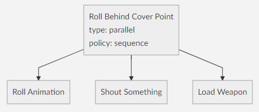

Gaming e Intelligenza Artificiale
======================

### IA nell'immaginario collettivo
 L'Intelligenza Artificiale (IA) porta alla mente **androidi** e **robot antropomorfi** che hanno la capacità di comportarsi, pensare e agire come persone, talvolta addirittura non distinguibili dagli esseri umani.
La cinematografia ci ha abituato a questo con film come:
- [Il mondo dei robot (_Westworld_)](https://it.wikipedia.org/wiki/Il_mondo_dei_robot) (1973)
- [Terminator](https://it.wikipedia.org/wiki/Terminator_%28film%29) (1984)
- [AI - Intelligenza Artificiale](https://it.wikipedia.org/wiki/A.I._-_Intelligenza_artificiale) di Spielberg (2001)
- [Io, Robot](https://it.wikipedia.org/wiki/Io,_robot_%28film%29) (2004)
- [Ex-machina](https://it.wikipedia.org/wiki/Ex_Machina_%28film%29) (2015)

Ma l’IA non è solo robotica.

### IA nel mondo reale 
L'IA nelle sue varie forme è parte della nostra vita quotidiana:
- **Siri** di Apple, **Cortana** di Microsoft e **Google Now**, sono alcuni esempi di applicazioni di IA comunemente usati da tutti noi. Questi sistemi sono in grado di comprendere e di rispondere in [linguaggio naturale](https://it.wikipedia.org/wiki/Elaborazione_del_linguaggio_naturale) (è una branca dell'IA) per soddisfare le richieste dell’utente.
- **I sistemi diagnostici e le centraline** che controllano le automobili moderne usano tecniche di IA per verificare lo stato del veicolo.
- L'**aspirapolvere robot** che circola autonomamente per casa (costruzione mappa di casa, sensori di individuzione ostacoli e loro aggiramento, pathfinding...)
-  Gli smartphone più recenti sono dotati di un **N**eural **P**rocessor **U**nit (es: processore Kirin a bordo dei Huawei e Honor ), un hardware in grado di elaborare reti neurali, per offrire:
  - **riconoscimento facciale, animali e oggetti**
  - **fotocamera intelligente** per catturare meglio l’ambiente
  - **Risparmio batteria** ottimizzando le risorse allocate 
- [Akinator](https://play.google.com/store/apps/details?id=com.digidust.elokence.akinator.freemium&hl=it), app in grado di indovinare personaggi e oggetti pensati dall'utente, tramite una serie di domande. Impressionante!

Si tratta di **sistemi ancora limitati**, progettati per adempiere a compiti piuttosto specifici. Tuttavia stanno arrivando sul mercato “agenti” in grado di interagire col mondo esterno, ad esempio:
-  **Automobili prive di conducente** come la [Google Driverless Car](https://it.wikipedia.org/wiki/Waymo), in grado di muoversi per le strade reagendo all’ambiente in cui è inserita.  Generalmente adottano una tecnologia nota come [SLAM (Simultaneous Localization And mapping)](https://en.wikipedia.org/wiki/Simultaneous_localization_and_mapping "Simultaneous localization and mapping") che usa una mappa offline e i dati dei molteplici sensori di cui l'auto è dotata. Per riconoscere gli oggetti utilizzano le [deep neural networks](https://en.wikipedia.org/wiki/Deep_neural_networks "Deep neural networks"), un tipo di architettura [deep learning](https://en.wikipedia.org/wiki/Deep_learning "Deep learning")
- Il sistema di IA di Google, [Deepmind](https://it.wikipedia.org/wiki/DeepMind) che, applicando avanzate tecniche di [machine learning](https://it.wikipedia.org/wiki/Apprendimento_automatico) (una branca dell'IA, che permette alle macchine di apprendere), è stato in grado di acquisire diverse capacità:
  - **imparare da solo a tradurre dal giapponese al koreano** sprovvisto di vocabolario (presumibilmente addestrato su coppie di testi nelle 2 lingue, un po' come la [stele di Rosetta](https://it.wikipedia.org/wiki/Stele_di_Rosetta) che riportando lo stesso testo in geroglifico, demotico e greco antico ha permesso ai ricercatori di tradurre i geroglifici).
  - **imparare da solo a giocare a [Go](https://en.wikipedia.org/wiki/Go_(game) "Go (game)")** e sconfiggere un campione del mondo, studiando una serie di partite realmente giocate.
  - [Apprendere nuovi concetti guardando filmati video, proprio come un bambino fa con la televisione](https://www.alphr.com/artificial-intelligence/1006327/how-google-deepmind-is-learning-like-a-child-deepmind-uses-videos-to). Il sistema si è auto-addestrato su 60 milioni di brevi filmati che hanno permesso la creazione di 2 reti neuronali separate, una per le immagini l'altra per l'audio. Una terza rete neuronale, poi, ha confrontato quelle immagini e quei suoni per metterle in relazione e trovare le corrispondenze. 

### IA nella storia
L’interesse della comunità scientifica per l’IA iniziò più di 70 anni fa: il **primo vero progetto di IA** risale al **1943** quando venne presentato al mondo scientifico il primo neurone artificiale.
Verso la fine degli **anni ’50** arrivarono poi i **primi prototipi funzionanti di reti neurali**, cioè modelli matematici sviluppati per riprodurre il funzionamento dei neuroni biologici per risolvere problemi su domini specifici.

 L’interesse del pubblico si fece maggiore grazie ad [Alan Turing](https://it.wikipedia.org/wiki/Alan_Turing) che già nel **1950** cercava di spiegare come un computer possa comportarsi come un essere umano. Famoso è il **test di Turing**, un criterio per determinare se una macchina sia in grado di pensare:
- Una macchina A, un individuo B ed un operatore C, tenuto separato da A e B
- L'operatore C è consapevole che uno dei due esaminati è una macchina ma non sa chi.
- C deve stabilire chi sia l'uomo e chi la macchina tramite una serie di domande (dattiloscritte, per evitare che tragga indizi ad esempio dalla voce o dalla calligrafia)
- Se su base statistica l'operatore C non è in grado di distinguere la macchina dall'umano, la macchina ha passato il test. 
<br/><br/>

 Sempre nel 1950 il ricercatore [Claude Shannon](https://it.wikipedia.org/wiki/Claude_Shannon) pubblicò l'articolo “**Programming a Digital Computer for Playing Chess**”  
che descriveva come un computer possa giocare a scacchi basandosi sulla posizione dei pezzi e la selezione delle mosse, in modo da restringere il numero delle possibili mosse da considerare. Lo stesso anno [Alan Turing](https://it.wikipedia.org/wiki/Alan_Turing) scrisse il primo programma di scacchi, ma "solo" nel **1962** venne realizzato il primo software che giocasse in modo credibile una partita vera e propria riuscendo a **sconfiggere avversari umani di basso livello**. Nel 1996 [IBM Deep Blue](https://it.wikipedia.org/wiki/IBM_Deep_Blue) **vince contro il campione del mondo in carica** [Garry Kasparov](https://it.wikipedia.org/wiki/Garri_Kimovi%C4%8D_Kasparov), imponendosi nella sfida uomo vs computer più famosa della storia.

### IA nei videogiochi
Da quanto visto finora, c'è sempre stata una **forte relazione tra l'IA e i giochi**. Anzi, possiamo tranquillamente affermare che **i giochi sono stati fondamentali per sviluppo dell'IA nel corso degli anni**.

In questo contesto tratteremo alcune delle principali tecniche di IA più comunemente usate nell'industria dei videogiochi. In particolare, tratteremo alcune delle aree dell'IA più importanti nel gaming, cioè **Movement AI**, **Pathfinding** e **Decision Making**, vedendole applicate in [GdxDemo3D](https://github.com/jsjolund/GdxDemo3D), una demo 3D sviluppata con GDX-AI, di cui esiste una versione semplificata online per browser al link [http://xpenatan.github.io/gdx-bullet-gwt/GdxDemo3D/](http://xpenatan.github.io/gdx-bullet-gwt/GdxDemo3D/).
In tale demo, il [modulo  pathfinding](https://github.com/libgdx/gdx-ai/wiki/Pathfinding) di gdx-ai in congiunzione un [navigation mesh](https://it.wikipedia.org/wiki/Navigation_mesh) gestisce la ricerca dei percorsi, il modulo [steering behaviors](https://github.com/libgdx/gdx-ai/wiki/Steering-Behaviors) gestisce il movimento dei personaggi, mentre i moduli [state machines](https://github.com/libgdx/gdx-ai/wiki/State-Machine) e [behavior trees](https://github.com/libgdx/gdx-ai/wiki/Behavior-Trees) sono utilizzati per modellare rispettivamente il cervello dei personaggi uomo e cane.


Gdx-AI
--------
[GDX-AI](https://github.com/libgdx/libgdx) è un framework di intelligenza artificiale, interamente scritto in Java, per sviluppare giochi con (ma anche senza) [LibGDX](https://github.com/libgdx/libgdx), un framework 2D/3D per giochi cross-platform che supporta le principali architetture desktop, mobile e web.

Il progetto GDX-AI, di cui chi vi sta parlando è l'autore principale, è un'estensione di LibGDX, mantenuta dal team ufficiale.

L'obiettivo di GDX-AI è di offrire **performance elevate** fornendo alcune delle **tecniche di IA più comunemente usate nell'industria dei videogiochi**. Tuttavia, allo stato attuale, copre solo parte dell'intera area IA per i videogiochi, che è davvero enorme.

Gdx-AI supporta le funzionalità illustrate nel seguito suddivise per tipologia.

#### Movement AI
 L'intelligenza di movimento viene utilizzata nei giochi 2D e 3D per far muovere gli agenti in maniera sensata. Esistono varie tecniche, GDX-AI supporta le seguenti: 
  - **Steering Behaviors**: I comportamenti di sterzo usati ad esempio per far muovere un'auto da corsa o un'astronave, per far muovere un personaggio evitando gli ostacoli mentre fugge o insegue, per far spostare gruppi di oggetti in maniera casuale ma armonica (es: stormo di uccelli, banco di pesci... ). Gli steering behaviors sono spesso usati per gli **effetti speciali nel cinema**. Il primo film ad aver usato il comportamento di flocking (cioè gregge, stormo) è stato [Batman Returns (1992)](https://en.wikipedia.org/wiki/Batman_Returns) con stormi di pipistrelli che escono in volo dalla caverna e branchi di pinguini in marcia. Anche nella trilogia de [Il Signore degli Anelli](https://it.wikipedia.org/wiki/Il_Signore_degli_Anelli_%28trilogia%29) il movimento delle orde di orchi è stato implementato ricorrendo agli steering behaviors.
  - **Formation Motion**: utilizzato per spostare gruppi di personaggi in modo coordinato mantenendo un determinato assetto, es: una flotta aerea, un esercito sul campo di battaglia. ecc...
 
#### Pathfinding

 I personaggi di un gioco solitamente necessitano di muoversi all'interno del livello di gioco.
Spesso, sanno dove vogliono andare, e devono trovare un modo per raggiungere la destinazione.
Per ognuno di questi personaggi l'IA deve calcolare un percorso adatto attraverso il livello da  un punto A al punto B. **Il percorso deve essere ragionevolmente corto e rapido**. Un agent che per spostarsi dalla cucina al salotto passa dalla mansarda non sembrerebbe poi così intelligente, no? :smile:

Il pathfinding, è ovunque nelle IA dei videogame. 

Il pathfinding sta al confine tra il [Decision Making](https://github.com/libgdx/gdx-ai/wiki/Decision-Making) e la [Movement AI](https://github.com/libgdx/gdx-ai/wiki/Movement-AI). Tipicamente, accade quanto segue:
1. la destinazione viene stabilita da una qualche tecnica di decision making
2. il pathfinder elabora il percorso
3. il sistema di controllo del movimento sposta il personaggio lungo il percorso

L'algoritmo più utilizzato per il pathfinding si chiama [A*](https://it.wikipedia.org/wiki/Algoritmo_A*), nelle sue innumerevoli varianti.  Essenzialmente è un algoritmo di ricerca su grafi che individua un percorso tra due nodi del grafo stesso. Utilizza una "stima euristica" che classifica ogni nodo per valutare la bontà del percorso che passa da lui.

#### Decision Making
 Esistono molte tecniche di decision making, ma a livello macro operano tutte nello stesso modo: il personaggio processa un set di informazioni che utilizza per generare un'azione da intraprendere.

L'input del sistema di decision making è la conoscenza posseduta dal personaggio, l'output l'azione che compierà.

GDX-AI supporta 2 delle più comuni tecniche di decision making:
- **State Machine**
- **Behavior Trees**

Macchine a stati finiti
------------------------

Fin dagli albori dei videogiochi, le macchine a stati finiti (FSM) sono state uno strumento tipico per dotare un NPC (Non Player Character, cioè un agente comandato dall'IA) di un'intelligenza almeno apparente. 

Una macchina a stati finiti è un automa (dispositivo) con un numero finito di stati. Una FSM può essere in un solo stato in qualsiasi momento. L'input dello stato corrente determina una transizione (cioè un'azione di passaggio) verso uno dei suoi stati in uscita. 

L'idea alla base delle FSM è quella di **decomporre un oggetto complesso in un insieme di stati facilmente gestibili**, che originano il **grafo degli stati**, anche noto in gergo come **pallogramma**.

### Esempio
Vediamo un esempio pratico di come si può creare un agente utilizzando le **FSM in combinazione con lo scambio di messaggi**.
Siamo in una tipica località nel Far West - beh occorre usare la fantasia perché questo esempio non prevede la grafica. Ogni cambiamento di stato (azione) genera un testo visualizzato a video.

Nel nostro immaginario paese nel **Far West** ci sono 2 personaggi: il **minatore Bob** e sua **moglie Elsa**:
-  Bob si sposta tra 4 luoghi: la **miniera d'oro**, la **banca** in cui deposita le pepite che trova, il **saloon** per dissetarsi e la sua **casa** per riposare. Cosa fa esattamente, dove e quando è stabilito dal suo stato corrente. Bob cambierà stato in base alle sue variabili **sete**, **fatica** e **pepite** trovate scavando nella miniera.
	
-  Elsa è prevalentemente impegnata a **pulire casa**, **preparare cena** e **andare in bagno**.
	
   
Naturalmente Bob e Elsa comunicano.  Non molto in realtà. Si scambiano solo **2 tipi di messaggi**:
- **HI_HONEY_I_M_HOME**: messaggio istantaneo usato da  Bob per informare Elsa che è tornato a casa.
- **STEW_READY** messaggio schedulato usato da Elsa con sè stessa per sapere quando tirare fuori lo stufato dal forno e con Bob per informarlo che la cena è in tavola.

Ecco un esempio di dialogo tra Elsa e Bob:
```
Bob: All mah fatigue has drained away. Time to find more gold!
Bob: Walkin' to the goldmine
Elsa: Walkin' to the can. Need to powda mah pretty li'lle nose
Elsa: Ahhhhhh! Sweet relief!
Elsa: Leavin' the Jon
Bob: Pickin' up a nugget
Elsa: Washin' the dishes
Bob: Pickin' up a nugget
Elsa: Makin' the bed
Bob: Pickin' up a nugget
Bob: Ah'm leavin' the goldmine with mah pockets full o' sweet gold
Bob: Goin' to the bank. Yes siree
Elsa: Washin' the dishes
Bob: Depositing gold. Total savings now: 3
Bob: Boy, ah sure is thusty! Walking to the saloon
Elsa: Makin' the bed
Bob: That's mighty fine sippin liquer
Bob: Leaving the saloon, feelin' good
Bob: Walkin' to the goldmine
Elsa: Washin' the dishes
Bob: Pickin' up a nugget
Bob: Ah'm leavin' the goldmine with mah pockets full o' sweet gold
Bob: Goin' to the bank. Yes siree
Elsa: Washin' the dishes
Bob: Depositing gold. Total savings now: 4
Bob: Leavin' the bank
Bob: Walkin' to the goldmine
Elsa: Makin' the bed
Bob: Pickin' up a nugget
Elsa: Makin' the bed
Bob: Pickin' up a nugget
Bob: Ah'm leavin' the goldmine with mah pockets full o' sweet gold
Bob: Goin' to the bank. Yes siree
Elsa: Washin' the dishes
Bob: Depositing gold. Total savings now: 6
Bob: WooHoo! Rich enough for now. Back home to mah li'lle lady
Bob: Leavin' the bank
Bob: Walkin' home
Instantaneous message HI_HONEY_I_M_HOME sent by Bob to Elsa
Message HI_HONEY_I_M_HOME received by Elsa
Elsa: Hi honey. Let me make you some of mah fine country stew
Elsa: Putting the stew in the oven
Elsa: Fussin' over food
Delayed message STEW_READY sent by Elsa to Elsa
Bob: ZZZZ... 
Elsa: Moppin' the floor
Bob: ZZZZ... 
Message STEW_READY received by Elsa
Elsa: StewReady! Lets eat
Instantaneous message STEW_READY sent by Elsa to Bob
Message STEW_READY received by Bob
Bob: Okay Hun, ahm a comin'!
Bob: Smells Reaaal goood Elsa!
Elsa: Puttin' the stew on the table
Bob: Tastes real good too!
Bob: Thankya li'lle lady. Ah better get back to whatever ah wuz doin'
Elsa: Washin' the dishes
Bob: ZZZZ... 
Elsa: Moppin' the floor
Bob: ZZZZ... 
Elsa: Makin' the bed
Bob: ZZZZ... 
```
Come si può vedere l'uso di messaggi combinato con le FSM rende piuttosto bene l'illusione di un dialogo tra due persone che interagiscono. E questo è solo un semplice esempio.

### Divide et Impera
 Il principale problema con le FSM è la crescita incontrollata (esplosione) degli stati.
Una tecnica comune per limitare questo fenomeno sono le **Macchine a stati gerarchiche**. Anziché combinare tutta la logica in un'unica grande FSM si possono individuare task indipendenti (sottoinsiemi di stati) e fare per ciascuno una propria FSM autocontenuta. Ad esempio, prendiamo un ipotetico agente con gli stati **Esplora**, **Combatti** e **Pattuglia**. Lo stato Combatti può essere a propria volta una FSM che gestisce gli stati di combattimento **Schiva**, **InseguiNemico** e **Spara**.

### Casi d'uso
In abito IA per i videogiochi, le FSM, con la loro semplicità, sono adatte quando:
- Si ha un agente il cui comportamento cambia a seconda di un qualche stato interno;
- Quello stato può essere diviso in un numero ragionevolmente piccolo di opzioni distinte;
- L'agente risponde ad una serie di input o eventi 

Oltre che per l'IA applicata ai videogame, le FSM sono utilizzate comunemente per implementare funzionalità come:
- manipolazione dell'input utente
- navigazione dei menu e delle GUI
- parsificazione di testo (es: compilatori)
- protocolli di rete


### Limitazioni
Anche usando le tecniche citate precedentemente, le FSM restano piuttosto limitate. Oggi l'IA nei videogiochi ricorre a tecniche più innovative e potenti come i **behavior tree** e i **sistemi di pianificazione**.


Behavior Trees
-------------------
Negli ultimi anni, i behavior tree (BT, in breve) sono il **principale formalismo utilizzato nell'industria dei giochi** per costruire complessi comportamenti di IA. Questo successo deriva dalla loro **semplicità di comprensione, utilizzo e sviluppo per i non programmatori**.

I BT sono stati proposti come **miglioramento delle macchine a stati gerarchiche** per la progettazione dei personaggi non giocatori (NPC, le entità pilotate dall'IA).
I loro **vantaggi** rispetto ai tradizionali approcci sono:
- **semplicità** di progettazione e implementazione
- **scalabilità** quando i giochi diventano grandi e complessi
- **modularità** per favorire la riusabilità e la portabilità.

I BT sono stati originariamente introdotti dalla [robotica](https://en.wikipedia.org/wiki/Robotics) e presto adottati per controllare i comportamenti dell'IA in giochi commerciali come lo sparatutto in prima persona (FPS) [Halo 2](http://www.gamasutra.com/view/feature/130663/gdc_2005_proceeding_handling_.php) e il gioco di simulazione di vita [Spore](http://chrishecker.com/My_liner_notes_for_spore#Behavior_Tree_AI).

### Concetti chiave
I principali problemi con le macchine a stati sono:
- **crescita esponenziale** di stati e transizioni
- **stati non facilmente riutilizzabili**; occorre preoccuparsi che determinate transizioni siano invalide quando vengono riutilizzate da diverse porzioni della logica AI.
In sostanza, le macchine statali mancano di un adeguato livello di modularità.

I BT offrono tale modularità incapsulando la logica degli stati in modo trasparente, rendendo gli **stati nidificati l'uno nell'altro in struttura ad albero** e limitando le transizioni solo a questi stati nidificati. Il nodo radice si dirama verso più nodi fino a raggiungere i nodi foglia e questi nodi foglia sono le azioni di base che definiscono il comportamento dell'IA a partire da uno stato che inizia dalla radice. Il concetto di stato è ora visto come un comportamento o attività **(task)** di alto livello, in base al quale i collegamenti ai nodi figlio nidificati definiscono sotto-attività che compongono il comportamento principale. I nodi foglia sono essenzialmente un gruppo di azioni di base che definiscono un comportamento.

Tutti i task ad ogni esecuzione ritornano un dei seguenti valori:
- **failure**: task non riuscito, cioè fallito
- **success**: task riuscito, cioè terminato con successo
- **running**: task non ancora terminato, da riprendere al frame successivo (ad esempio le animazioni o calcoli particolarmente onerosi richiedono più frame)

I task di un BT sono formalmente costruiti su **2 costrutti**:
- **task foglia**
- **task compositi**, da cui possiamo enucleare i **task decoratori** che sono un particolare tipo di task composito.

### Task foglia
I task foglia sono **nodi terminali dell'albero** e definiscono azioni di basso livello che costituiscono nell'insieme il comportamento generale. In genere sono implementati **sotto forma di codice, magari in uno script**, e possono adempiere a cose del tipo: 
- considerare il valore di una variabile nello stato di gioco
- eseguire un'animazione
- riprodurre un effetto sonoro

Sono di 2 tipi:
- **Azioni** che causano effetti sul livello di gioco, ad esempio:
  - spostare un personaggio
  - decrementare lo stato di salute
- **Condizioni** che interrogano lo stato degli oggetti del livello di gioco, ad esempio
  - la posizione di un personaggio
  - la quantità di salute


**Esempio**: nella demo quando l'umano muore (perché l'utente ha premuto il tasto :skull:, ma non preoccupatevi possiamo tranquillamente resuscitarlo!!!) il cane se è nelle vicinanze se ne accorge e va da lui a piangerlo. Per modellare questo comportamento possiamo definire *in modo informale* il BT corrispondente al task `Cry For Human Death` come segue


Il task radice è composto da due task figlio (le foglie), il figlio di sinistra è una condizione che capisce se il padrone è visibile e il figlio di destra è un'azione che fa compiangere al cane la sua morte.
Ogni task può avere **esito positivo o negativo**, il che a sua volta definisce se il task padre (nell'esempio il task composito `Cry For Human Death`, che come vedremo a breve è una sequenza) ha esito positivo o negativo.

Tipicamente, tra i **task foglia nativi** del formalismo BT (forniti perché utili in molte circostanze) troviamo:
- **Failure**: fallisce immediatamente
- **Success**: ha successo immediatamente
- **Wait**: Restituisce **Running** per il periodo di tempo specificato, dopo di che ritorna esito positivo.

### Task compositi
I task compositi offrono un modo standard per descrivere le relazioni tra i task figli, ad esempio come e quando devono essere eseguiti. Contrariamente ai foglia, che sono definite dall'utente, **i nodi compositi sono nativi**, cioè predefiniti e forniti dal formalismo dei BT. Permettono di costruire diramazioni dell'albero per organizzare i loro sotto-task (i figli). Fondamentalmente, i rami tengono traccia dei loro sotto-task (condizioni, azioni o altri nodi compositi) e **il loro comportamento si basa sul comportamento dei figli**.

Si può pensare ai task compositi come alla **spina dorsale del formalismo BT**. Mentre i nodi foglia (definiti dall'utente) sono tipicamente molti, iI formalismo BT fornisce **solo una manciata di task compositi** perché  sufficienti a costruire comportamenti molto sofisticati. In particolare, i nodi compositi sono: **task sequenza**, **task selettore**, **task parallelo** ed alcuni **task decoratori**.

### Sequence
Una sequence è un task di diramazione che esegue a turno ciascuno dei suoi task figlio. Restituisce un codice di fallimento non appena uno dei suoi figli fallisce. Finché i suoi figli hanno successo, va avanti col successivo. Finiti i figli, restituisce successo. **Le sequenze rappresentano una successione di compiti da intraprendere**. 

**Esempio 1:** L'esempio precedente, in cui il cane piange la morte del padrone, è definito in maniera più formale dal BT sottostante. Ora il nodo composito è esplicitamente dichiarato di tipo sequence.


**Esempio 2:** Il cane per poter giocare col suo padrone, che lo ha chiamato fischiando, deve eseguire la sequenza di azioni rappresentata qui sotto:


Se una qualunque azione fallisce (ad esempio il padrone dopo il fischio se ne va via mentre il cane lo sta raggiungendo, oppure non gli lancia il bastone entro un certo tempo), la sequenza fallisce e il gioco tra i due finisce. Se al contrario, tutti i task nella sequenza hanno esito positivo, cioè il cane riesce a raccogliere il bastone, la sequenza nel suo insieme è riuscita.  

> **Random Sequence**
> E' una variante non deterministica del task sequence, che aiuta a rendere la IA meno monotona nelle sue azioni. Invece di esegue i figli nell'ordine in cui sono nell'albero (da sinistra a destra), **il random sequence esegue i figli in ordine casuale**.
> **Esempio**: Supponiamo che un NPC voglia incendiare un edificio, che magari il giocatore deve difendere. Per svolgere questo compito servono *fiammiferi* e *benzina* e, ovviamente, l'ordine in cui li si ottiene è irrilevante. Useremo una random sequence `Burn Building` con i due figli `Get Matches` e `Get Gasoline`.

### Selector
Un selector è un task di diramazione che esegue a turno ciascuno dei suoi comportamenti figlio. Restituisce un codice di stato di successo non appena uno dei suoi figli ha successo. Per ogni figlio che fallisce, processa il successivo. Esauriti i nodi figlio, restituisce un codice di fallimento.
**I selettori sono usati per scegliere la prima azione che ha successo in una serie di azioni possibili**. 

**Esempio:** Le azioni che il cane fa quando non è impegnato col padrone sono quelle tipiche di un cane in libertà: fa pipì, scorrazza qua e là correndo e camminando, e quando è stanco si siede o si sdraia. Questo comportamento può essere modellato componendo i task menzionati con un selettore 


Il selettore processa i figli nell'ordine e proverà a far fare la pipì al cane. Se ciò fallisce (magari per mancanza di un albero nelle vicinanze), proverà a far correre il cane. Se questo ha esito positivo, si interromperà tornando successo . Se invece fallisce (magari perché il cane corre solo sull'erba ed ora è sull'asfalto) proverà a camminare e così via.
In realtà la demo non è così sofisticata e non presenta controlli tipo la vicinanza dell'albero, la superficie sotto le zampe, ecc... Si può ottenere un effetto comunque realistico semplificando le cose e usando un random selector.
> **Random Selector**
> E' una variante non deterministica del selector, che aiuta a rendere la IA meno monotona nelle sue scelte. 
> Mentre il selettore standard esegue ciascuno dei figli in un ordine rigoroso definito in anticipo da chi ha creato l'albero, **il random selector esegue i suoi figli in ordine casuale**. Nell'esempio precedente i task figli possono ritornare sempre successo, poiché il random selector determina casualmente l'azione che il cane deve intraprendere. Il primo task scelto viene eseguito, e ritornando successo, fa riuscire a sua volta il random selector. 

#### Parallel
Il task composito parallel gestisce comportamenti "simultanei" eseguendo i propri figli in parallelo.
Il parallel esegue continuamente i suoi figli fino a che un task non ritorna uno stato che dipendentemente dalla sua *policy* (selector o sequence) ne determina l'uscita.

Ecco alcuni usi tipici di questo task:
- **Azioni non conflittuali**: usabile per insiemi di azioni che possono avvenire contemporaneamente. Ad esempio, un NPC particolarmente abile che gioca a [Nerf](https://it.wikipedia.org/wiki/Nerf), grazie al task parallel può rotolare con una capriola al riparo mentre urla qualcosa e ricarica di vernice l'arma.
	
- **Verifica delle condizioni**: un uso molto comune del task parallel è verificare continuamente se determinate condizioni sono soddisfatte durante l'esecuzione di un'azione. Ad esempio, si può far reagire l'NPC ad un evento mentre dorme o girovaga. Allo stesso modo il nostro cane, che nell'esempio del sequence nel task `Wait For Stick Thrown` incita il padrone in attesa che gli lanci il bastone, può reagire al lancio. Basta sostituire il task foglia menzionato con il BT seguente: 
	

	Questo caso d'uso è importante negli alberi di comportamento perché da solo **copre buona parte delle funzionalità di una macchina a stati**, in particolare la capacità di cambiare azione quando si verificano eventi importanti e sorgono nuove opportunità. Invece di eventi che innescano transizioni tra stati, possiamo usare sotto-alberi come stati e farli funzionare in parallelo con una serie di condizioni. Nel caso di una macchina a stati, quando viene soddisfatta la condizione, viene attivata la transizione. In un BT il comportamento viene eseguito fintanto che la condizione ritorna un risultato che ne determina l'uscita dipendentemente dalla policy.
- **Comportamento di gruppo**: si può usare il task parallel per controllare il comportamento di un gruppo di personaggi.
 **Esempio:** Consideriamo una **squadra di di calcio**. Ciascun giocatore ha nel proprio BT sia le azioni individuali (ad esempio `Calcia`, `Corri`, `Cammina` e `Contrasta`) che le azioni di squadra, contenute in task paralleli all'interno di un selettore di livello superiore.
Un  attaccante avrà azioni di squadra tipo `Avanza col portatore di palla`, `Frapponiti tra difensore e portatore di palla`, `Occupa zona libera in area`, `Mira a un compagno`, `Mira in porta`, ecc... Se uno dei membri del team non può svolgere il proprio ruolo nella strategia, il parallel tornerà un failure e il selettore dovrà scegliere un'altra opzione, magari determinando un cambio di strategia (schema).
	

#### Decorator
Il nome decorator deriva dal [decorator pattern](https://it.wikipedia.org/wiki/Decorator) della programmazione orientata agli oggetti (OOP). Questo **design pattern** consiste in una classe che avvolge (wrap, in inglese) un'altra classe, modificandone il comportamento. Il decoratore ha la stessa interfaccia della classe che avvolge, quindi il resto del software non ha bisogno di sapere se si tratta della classe originale o di un suo decoratore.

Nel contesto dei BT, un decoratore è un task che ha **un singolo task figlio di cui modifica il comportamento**.


Tipicamente, il formalismo BT fornisce una serie di utili **decoratori nativi**, tra cui:
- **AlwaysFail**  fallisce sempre, sia che i figlio fallisca o abbia successo.
- **AlwaysSucceed** ha sempre successo, sia che i figlio fallisca o abbia successo.
- **Include** innesta un sotto-albero a runtime e non. Questo decoratore fornisce una maggior modularità e riusabilità.
- **Invert** ha successo se il figlio fallisce e viceversa.
- **Limit** controlla il numero massimo di volte in cui il task figlio può essere eseguito. Ad esempio, lo si può usare per assicurarsi che un NPC non continui a tentare di forzare una porta che il giocatore ha blindato.
- **Repeat** ripete il task figlio un verto numero di volte, magari infinito. Questo task ha sempre successo quando raggiunge il numero specificato di iterazioni.
- **SemaphoreGuard** controlla quanti personaggi possono usare contemporaneamente il task figlio, che rappresenta una risorsa condivisa e limitata utilizzata da più NPC nei rispettivi BT. Ad esempio, si può associare una semaforo al personaggio del giocatore per assicurarsi che al massimo 3 nemici lo attacchino simultaneamente. Questo decoratore fallisce quando non riesce ad acquisire il semaforo. Ciò permette ad un task selettore antenato (che lo precede nel percorso all'indietro verso la radice) di determinare un'altra azione che non coinvolge la risorsa contesa.
- **UntilFail** ripete il task figlio fino a che questo fallisce, ritornando in fine lo stato di successo.
- **UntilSuccess** ripete il task figlio fino a che questo ha successo, ritornando in fine lo stato di successo.
