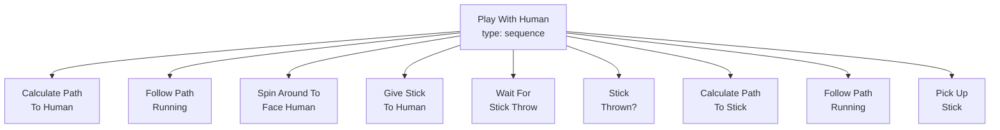

```mermaid
graph TD
   PlayWithHuman[Play With Human<br/>type: sequence]-->CalculatePathToHuman[Calculate Path<br>To Human]
   PlayWithHuman-->FollowPathToHumanRunning[Follow Path<br>Running]
   PlayWithHuman-->SpinAroundToFaceHuman[Spin Around To<br>Face Human]
   PlayWithHuman-->GiveStickToHuman[Give Stick<br>To Human]
   PlayWithHuman-->WaitForStickThrow[Wait For<br>Stick Throw]   
   PlayWithHuman-->StickThrown[Stick<br/>Thrown?]   
   PlayWithHuman-->CalculatePathToStick[Calculate Path<br>To Stick]
   PlayWithHuman-->FollowPathToStickRunning[Follow Path<br>Running]
   PlayWithHuman-->PickUpStick[Pick Up<br>Stick]
```
